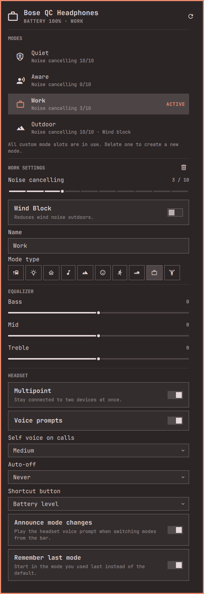

# Bose Headphones for Omarchy

**Control your Bose headphones from the Omarchy bar.** Switch modes, tune noise cancelling,
create your own modes and change headset settings without picking up your phone.



Bose only offers its controls through the Bose phone app. On a Linux desktop that means reaching
for your phone every time you want more noise cancelling for a meeting, a transparent mode for a
coffee order, or wind block for a walk. This plugin puts all of that one click away in your bar,
and a scroll over the bar icon cycles modes.

It talks to the headset directly over Bluetooth using Bose's own control protocol. No Bose
account, no cloud, no phone and no extra dependencies beyond Python and BlueZ.

## What you get

- **Modes at a glance.** The bar icon shows the active mode. Click a mode in the panel to switch,
  with the headset's voice announcement if you like.
- **Edit modes.** Noise cancelling level, Wind Block, ActiveSense and immersive audio
  (Off / Still / Motion), wherever your headset allows changing them.
- **Create and delete custom modes** with the same mode types the Bose app offers: Commute, Focus,
  Home, Music, Outdoor, Relax, Run, Walk, Work and Workout.
- **Equalizer:** bass, mid and treble.
- **Headset settings:** multipoint, voice prompts, self voice on calls, auto-off timer, shortcut
  button and whether the headset remembers the last mode.
- **Live.** Changes made with the headset buttons or the phone app appear in the bar within a second.

### It adapts to your headphones

The plugin doesn't carry a list of models and features. On connect it asks the headset which
functions it supports, how many custom mode slots it has and which settings each mode allows,
then shows exactly those controls. A setting your headphones don't have simply doesn't appear.

## Supported headphones

Bose headphones controlled by the current Bose app share the same protocol.

| Status | Headphones |
|---|---|
| **Tested** | QuietComfort Headphones (2023) |
| **Expected to work** | QuietComfort Ultra Headphones (1st and 2nd gen), QuietComfort Ultra Earbuds (1st and 2nd gen), QuietComfort Earbuds II, QuietComfort 45, Noise Cancelling Headphones 700, Ultra Open Earbuds |
| **Basic support** | Older models such as QuietComfort 35 II have no custom modes; the plugin shows the settings they report |

Models that only allow control over Bluetooth LE Audio may not connect yet. If you try the plugin
with headphones not listed as tested, please open an issue with the output of `bosectl status`
so the table can grow.

## Install


```sh
omarchy plugin add https://github.com/kristoferlund/omarchy-bose-headphones.git --enable
```

Omarchy shows a warning that plugins run unsandboxed and asks you to confirm. Then pair and
connect your headphones as usual (for example from the Omarchy Bluetooth panel); the widget finds
the first connected Bose device on its own.

To update to the latest version later:

```sh
omarchy plugin update io.github.kristoferlund.bose
```

**Requirements:** Omarchy Quattro and Bose headphones that are paired and connected. Nothing else
to install: the plugin needs only Python 3 (standard library) and BlueZ, and a standard Omarchy
install already has both. If you removed either, restore them with:

```sh
sudo pacman -S --needed python bluez bluez-utils
```

## Configure

The widget is added to the right side of the bar. Move it with:

```sh
omarchy bar move io.github.kristoferlund.bose --section center
```

Voice announcements for mode switches can be turned off in the panel under *Headset*.

## Remove

```sh
omarchy plugin remove io.github.kristoferlund.bose
```

The background daemon (see below) exits on its own within five minutes once nothing uses it.
Besides its own folder, the plugin only keeps the headset's Bluetooth channel number in
`~/.cache/bosectl/`; delete that folder to remove every trace.

## What runs on your system

- `bosectl watch`, started by the widget, and `bosectl daemon`, a background Python process it
  starts on demand. The daemon holds the headset's Bluetooth control connection, listens on a
  private socket in `$XDG_RUNTIME_DIR`, exits after five idle minutes and restarts itself when
  the plugin is updated.
- `bluetoothctl`, called to find the connected Bose headset.

No root privileges, system services, installers, network access or downloads are involved.

## Using the panel

| Action | Where |
|---|---|
| Switch mode | Click a mode, or scroll over the bar icon |
| Change a mode's settings | Select the mode; its settings appear below the list |
| New mode | The **+** next to *Modes* (shown when a custom slot is free) |
| Delete a custom mode | The bin icon next to the mode's settings |
| Reset an EQ band | Double-click its value |
| Reconnect | The refresh icon, or middle-click the bar icon |

## bosectl

The widget is built on `bosectl`, a command-line tool in the plugin folder that works on its own:

```sh
bosectl status                 # device, battery, modes and settings
bosectl mode Outdoor --prompt  # switch mode with the voice announcement
bosectl mode-edit Work --noise-cancel 6 --wind-block on
bosectl mode-create Run --icon run
bosectl mode-delete Run
bosectl set eq bass 3
bosectl set multipoint off
bosectl watch                  # JSON lines with the full state on every change
bosectl -j modes               # JSON output for any command
```

Headphones accept only one control connection at a time, so `bosectl watch` starts a small
background daemon that holds the connection, reconnects when the headphones come back and serves
all other `bosectl` calls. Without the daemon, `bosectl` connects directly.

`bosectl` lives in the plugin folder; to use it from a terminal, link it onto your `PATH`, e.g.
`ln -s ~/.config/omarchy/plugins/io.github.kristoferlund.bose/bosectl ~/.local/bin/bosectl`.
The Bose phone app keeps working alongside it.

## How it works

The Bose app controls headphones with BMAP, a compact binary request/response protocol carried
over a Bluetooth serial (RFCOMM) channel. `bmap.py` implements the parts needed here with the
Python standard library. [PROTOCOL.md](PROTOCOL.md) documents the messages and how they behave
on real hardware, and `research/` holds the scripts used to map the protocol.

## Development

```sh
omarchy plugin validate .
qmltestrunner -input tests -import "$OMARCHY_PATH/shell" -o -,txt
python3 -m py_compile bmap.py bosectl
```

Omarchy doesn't allow symlinks in plugin folders. Develop in a clone at
`~/.config/omarchy/plugins/io.github.kristoferlund.bose`, or clone your working copy there and
`git pull` after committing. Saving files in that folder reloads the plugin; if a change doesn't
show up, run `omarchy-restart-shell`.

## License

MIT, see [LICENSE](LICENSE). Not affiliated with, endorsed by or sponsored by Bose Corporation.
Bose, QuietComfort and ActiveSense are trademarks of Bose Corporation.
